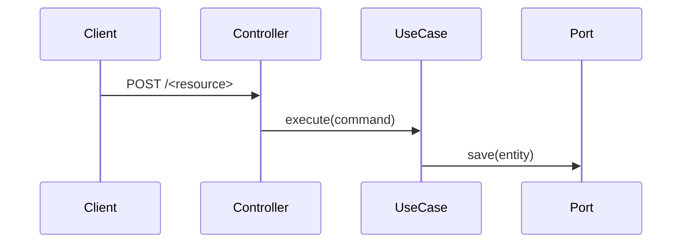

# Design — `<feature-name>`

> **Template.** Copy `specs/__template__/` to `specs/<feature-name>/`.
> This is NOT first-principles engineering: `docs/architecture.md` and
> `docs/conventions.md` already decide the defaults. Document only where this
> feature touches or pushes their boundaries. Delete sections that do not
> apply — an empty section is noise, a missing one is a gap.

## Starting point

What already exists in the repository today, verified by reading it (not
assumed): modules present, classes to be changed, whether the owning module
has to be created as a new gradle subproject.

- `<module>`: `<exists | must be created (settings.gradle + build.gradle)>`
- Existing classes touched: `<path/to/Class.java>`

## Classes, ports and signatures

Every new or changed type, with its module and hexagonal layer
(`application` / `domain` / `infrastructure`).

| Type | Module / layer | Kind | Purpose |
|---|---|---|---|
| `Thing` | `.cart.domain.models.thing` / domain | model | `<one line>` |
| `ThingService` | `.cart.domain.ports.out.thing` / application | service | `<one line>` |
| `AddThingUseCase` | `.cart.application.thing` / application | class | `<one line>` |
| `ThingRepository` | `.cart.domain.ports.in.thing` / domain | port (interface) | `<one line>` |
| `JpaThingRepository` | `.cart.infrastructure.thing` / infrastructure | adapter | `<one line>` |

New or changed signatures:

```java
public final class <UseCase> {
  public <UseCase>(<Port> port);          // constructor injection only
  public <Result> execute(<Command> command);
}
```

## HTTP contract

Delete if the feature exposes no endpoint. Level 2 of
`docs/verification.md` applies to every row here.

| Verb | Path | Request body | Success | Errors |
|---|---|---|---|---|
| `POST` | `/<resource>/{id}/items` | `{"...": "..."}` | `201` + `<Response>` | `404 <CODE>`, `400 <CODE>` |

Response payload:

```json
{ "<field>": "<value>" }
```

springdoc annotations required on every public controller method.

## Persistence

Delete if the feature owns no table. Rules in `docs/architecture.md`
(exclusive table ownership).

| Table | Owning module | Columns | Migration |
|---|---|---|---|
| `<module>_<thing>` | `<module>` | `<id, ...>` | `<module>/src/main/resources/db/migration/V<n>__<name>.sql` |

Foreign identifiers from other modules are stored as plain values
(`tractor_id`), never as database relations. No joins, FKs, views or native
queries across modules.

## Cross-module interaction

Delete if the feature stays inside one module. Otherwise: which public API is
called, or which domain event is published and who consumes it.

- `<cart>` publishes `<CheckoutStarted>` → consumed by `<inventory>`

## Exceptions

Every exception extends `TractorStoreException`.

| Exception | Thrown when | HTTP mapping |
|---|---|---|
| `<Thing>NotFoundException` | `<condition>` | `404` `<CODE>` |

## New dependencies

| Dependency | Module | Why it is needed | Why nothing already present suffices |
|---|---|---|---|
| `<group:artifact>` | `<module>` | `<reason>` | `<reason>` |

Empty table is the expected answer for most features.

## Diagram

Optional. Use a mermaid block when the flow crosses more than two components.



## Rejected alternative

At least one, with the reason. This is the section a human reads to decide
whether to approve.

- **`<alternative>`** — rejected because `<reason grounded in docs/architecture.md
  or in a concrete constraint, not in taste>`.
